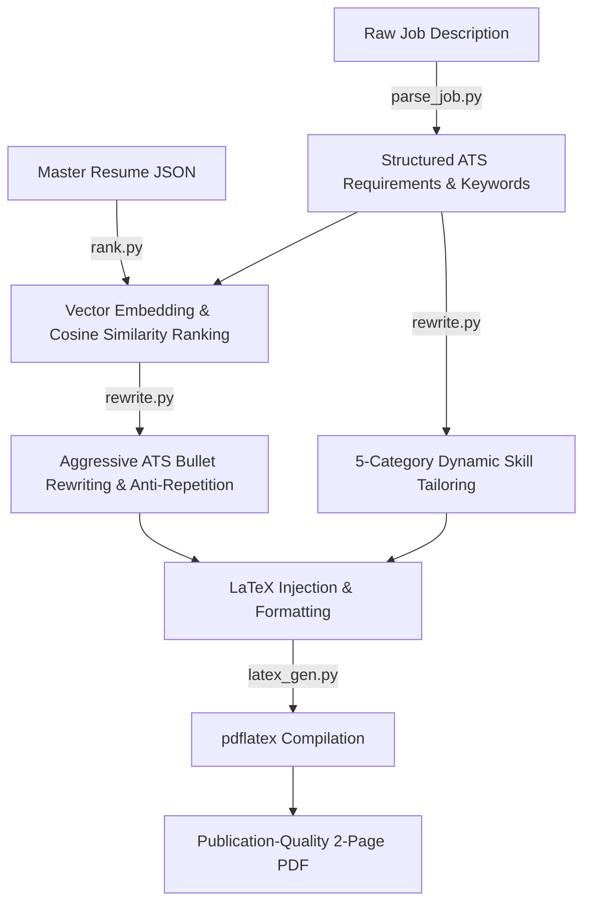

# AI-Powered ATS Resume & Cover Letter Builder

An intelligent, automated pipeline that leverages Google Gemini generative AI models (`gemini-3.5-flash`, `gemini-3-flash-preview`, `gemini-2.5-flash`, and `gemini-embedding-2`) to dynamically tailor resumes and generate personalized cover letters engineered to achieve a **95–100% Applicant Tracking System (ATS) keyword match rate**.

---

## ✨ Key Features

- 🎯 **Deep ATS Job Parsing:** Automatically analyzes raw job descriptions to extract required hard skills, soft skills, technologies, core responsibilities, implied competencies, and top critical ATS keywords.
- 🧠 **Semantic Bullet Ranking:** Uses vector embeddings (`gemini-embedding-2`) to compute cosine similarity between your master resume bullet points and job requirements, automatically selecting and ranking the highest-impact experiences.
- ✍️ **Aggressive ATS Rewriting & Anti-Repetition Engine:** Rewrites bullet points to inject exact job keywords verbatim while enforcing strict vocabulary diversity across experience and project sections (zero action verb or keyword recycling).
- ⚡ **Dynamic 5-Category Skill Tailoring:** Restructures skills into exactly 5 prioritized categories formatted with precise character constraints to guarantee clean line wrapping and strict **2-page LaTeX rendering**.
- 📝 **Automated Cover Letter Synthesis:** Generates compelling, structured cover letters tailored to the candidate's background and the target company's mission.
- 📄 **LaTeX to PDF Compilation:** Formats data into custom LaTeX templates and compiles directly into publication-quality PDFs via `pdflatex` (supporting MiKTeX on Windows and TeX Live on Linux/macOS).
- 🔄 **Resilient Model Rotation:** Implements automatic fallback across multiple Google Gemini model tiers to gracefully handle API rate limits (`429 Too Many Requests`) and quota exhaustion without interrupting workflow.

---

## 🏗️ Architecture & Project Structure

```text
Resume-Builder/
├── data/
│   ├── master_resume.json          # Candidate master resume data (experiences, projects, skills, certs)
│   ├── template.tex                # LaTeX template for resumes
│   └── cover_letter_template.tex   # LaTeX template for cover letters
├── output/                         # Generated LaTeX (.tex) and compiled PDF (.pdf) documents
├── src/
│   ├── main.py                     # CLI pipeline orchestrator
│   ├── parse_job.py                # LLM job description parser & keyword extractor
│   ├── rank.py                     # Semantic vector embedding & cosine similarity ranking engine
│   ├── rewrite.py                  # ATS bullet rewriter, summary generator, and skill tailorer
│   ├── cover_letter.py             # Cover letter content generator
│   ├── latex_gen.py                # LaTeX placeholder injector and pdflatex compiler wrapper
│   ├── utils.py                    # Environment management, file I/O, and API fallback handler
│   └── list_models.py              # Utility script to query available Google GenAI models
├── job.txt                         # Target job description input file
└── README.md                       # Project documentation
```

---

## 🚀 Getting Started

### 1. Prerequisites
- **Python 3.10+**
- **Google GenAI SDK** (`google-genai`, `numpy`)
- **LaTeX Distribution**:
  - **Windows**: [MiKTeX](https://miktex.org/) (ensure `pdflatex` is installed and accessible via system `PATH` or MiKTeX default directory).
  - **macOS / Linux**: TeX Live (`sudo apt install texlive-full` or `brew install mactex`).
- **Google Gemini API Key**: Obtain a key from Google AI Studio.

### 2. Installation

Clone the repository and set up your Python environment:

```bash
git clone https://github.com/yugcpatel/Resume-Builder.git
cd Resume-Builder

# Create and activate a virtual environment (optional but recommended)
python -m venv .venv
# On Windows:
.venv\Scripts\activate
# On macOS/Linux:
source .venv/bin/activate

# Install dependencies
pip install google-genai numpy
```

### 3. Environment Configuration

Create a `.env` file in the root directory of the project:

```env
GEMINI_API_KEY=your_actual_api_key_here
```

---

## 💻 Usage

1. **Prepare Your Master Data**: Ensure your complete background, experiences, projects, and certifications are documented in `data/master_resume.json`.
2. **Input Target Job**: Paste the raw job description into `job.txt` (or create a new text file).
3. **Run the Pipeline**:

```bash
cd src
python main.py ../job.txt
```

4. **Select Output Option**:
When prompted in the terminal, choose your desired output:
```text
What would you like to generate?
1: Resume only
2: Resume + Cover Letter
Enter option (1 or 2): 1
```

5. **Retrieve Your Files**: Once compilation is complete, check the `output/` directory for your tailored `resume <Company>.pdf` (and `cover_letter <Company>.pdf`).

---

## ⚙️ How the Pipeline Works



1. **Extraction**: `parse_job.py` calls Gemini to distill the posting into critical ATS rejection keywords, required technologies, and implied soft skills.
2. **Semantic Filtering**: `rank.py` batches bullet points through `gemini-embedding-2` to rank every experience item by vector similarity against the job posting, retaining only the highest-scoring bullets.
3. **Tailoring & Rewriting**: `rewrite.py` reconstructs bullet points using action verbs and verbatim ATS keywords while maintaining strict vocabulary diversity across sections.
4. **Layout Enforcement**: Skills are dynamically grouped into 5 categories with strict character thresholds (Categories 1–3 take exactly 3 lines; Categories 4–5 take exactly 2 lines), ensuring a perfect 2-page document layout.
5. **Compilation**: `latex_gen.py` injects escaped strings into LaTeX templates and invokes `pdflatex` to output your polished PDF.

---

## 🛠️ Troubleshooting

- **`pdflatex not found`**: Ensure MiKTeX or TeX Live is installed and added to your system environment variables (`PATH`). On Windows, the script automatically checks default MiKTeX installation directories (`C:\Program Files\MiKTeX\...` or `%USERPROFILE%\AppData\Local\Programs\MiKTeX\...`).
- **`429 Too Many Requests` / Rate Limiting**: The built-in resilient API handler in `utils.py` will automatically cascade through fallback models (`gemini-3.5-flash` → `gemini-3-flash-preview` → `gemini-2.5-flash` → `gemini-3.1-flash-lite`). If all models exhaust their rate limits, wait 60 seconds and re-run.

---

## 📝 License

This project is open-source and available under the MIT License.
